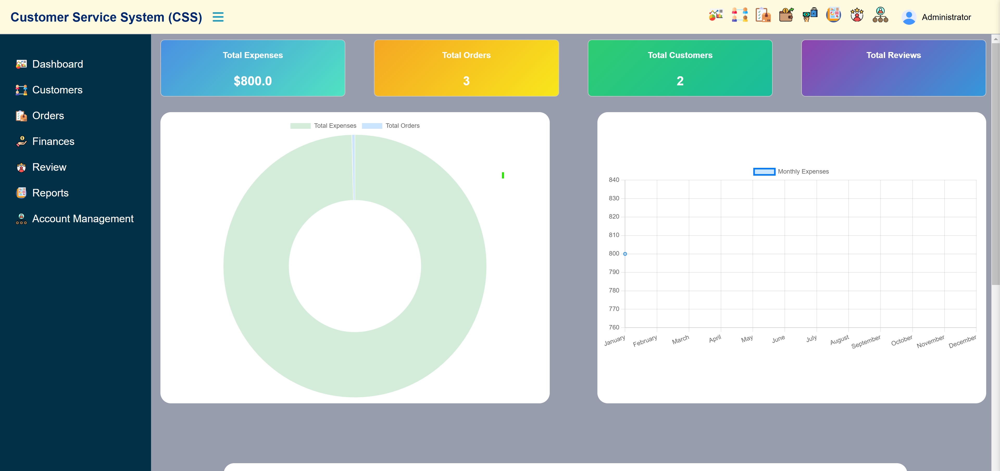
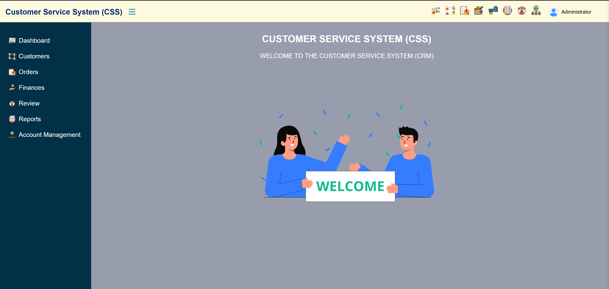
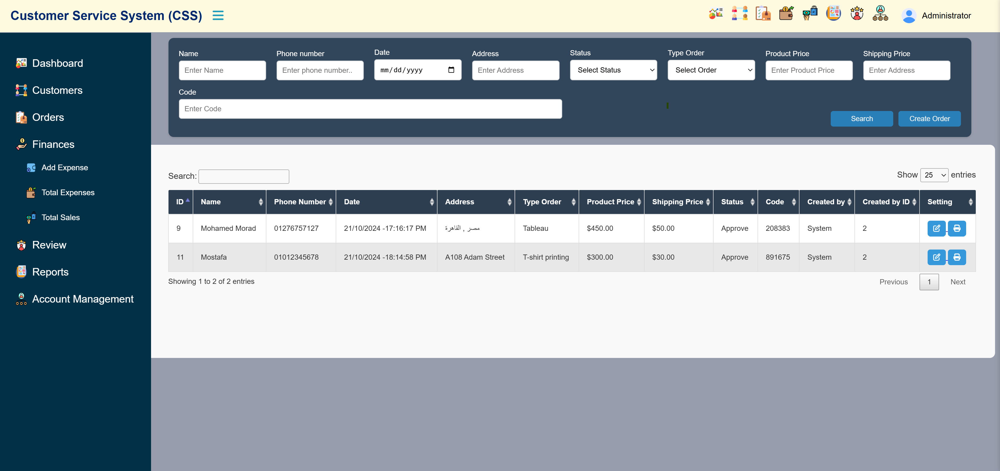
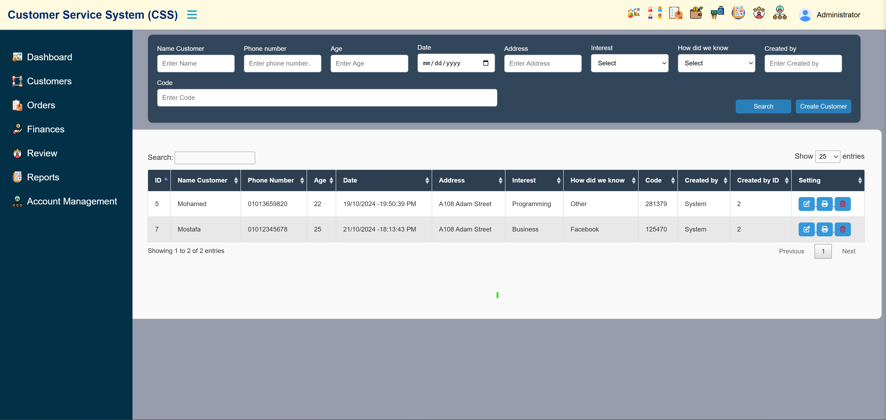
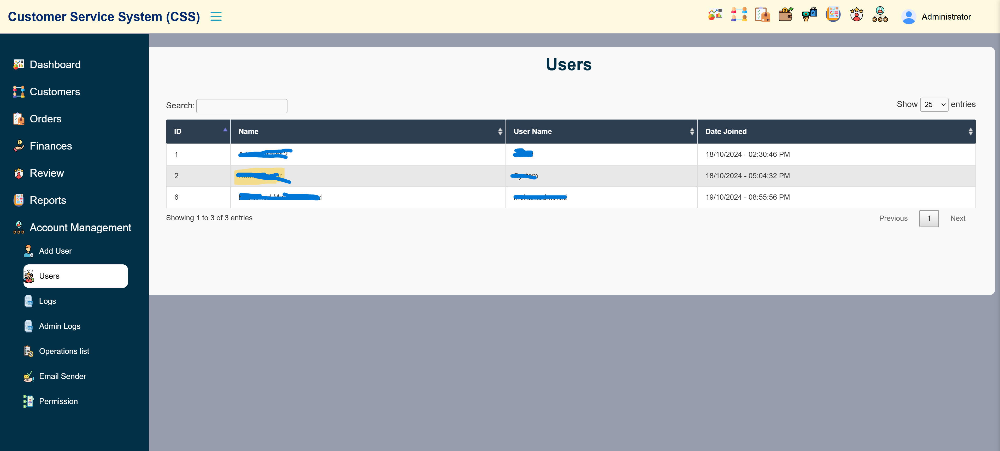
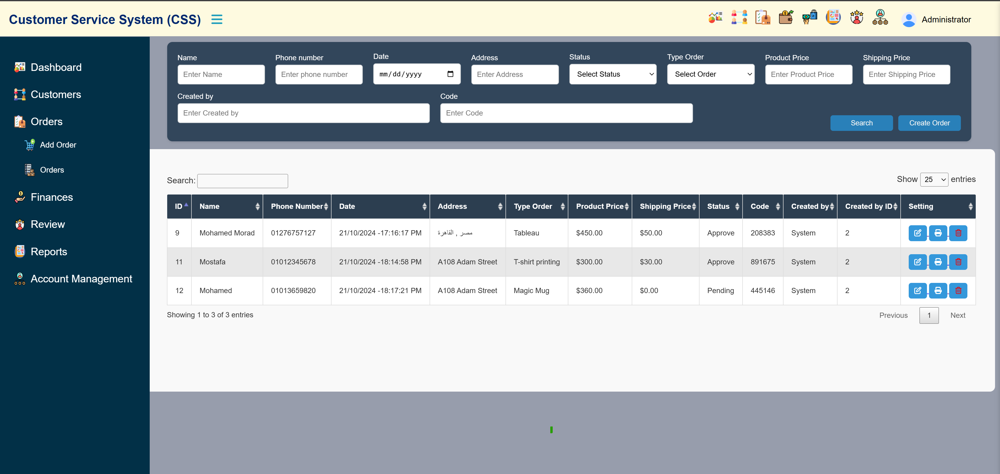
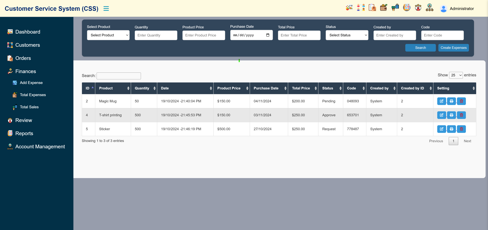
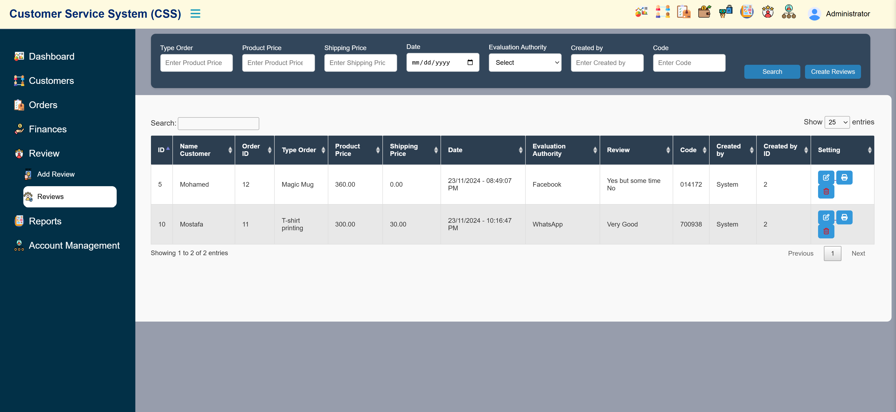
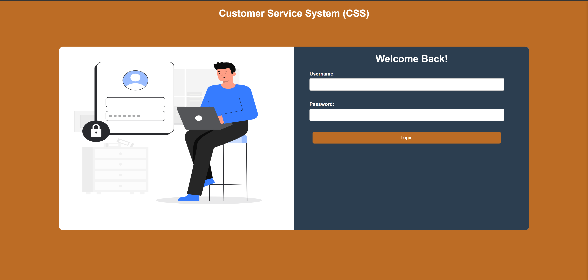
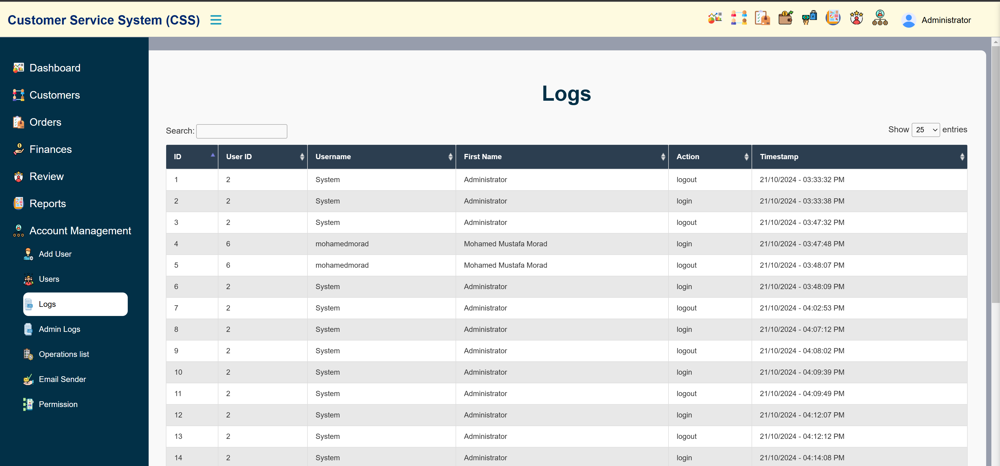

# Store and Sales Management System

An integrated system for managing products, orders, expenses, and customer reviews in an efficient and organized manner.

## ✨ Key Features

- ✅ Easy and efficient product management
- ✅ Accurate and organized order tracking
- ✅ Automatic expense calculations to save time and effort
- ✅ View and analyze customer reviews to improve service quality
- ✅ Simple and fast user interface suitable for everyone

## 🖼 Screenshots

### Dashboard




### Administration




### Creation Forms


### Expenses



### Reviews


### Profile


### Security




## ⚙️ Installation

1. Clone the repository:
```bash
git clone https://github.com/Mohamedmorad2/Customer-Service-Management-System.git
